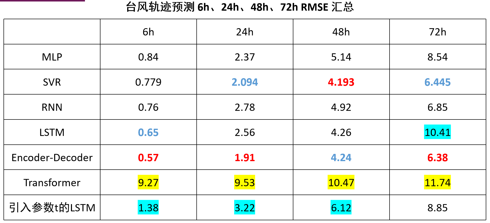

- [数据来源](https://tcdata.typhoon.org.cn/zjljsjj_zlhq.html)
- 请使用2000-2015年间的台风数据集作为训练集预测2016-2020年的台风信息


朴素模型：

- 随机森林()
- MLP(wxy)
  - (x1,x2,x3)->x4,
- RNN(xym)
  - 

- LSTM(cym)

  - da

  


处理数据：

- $n\times s\times (d+4)$的array，n表示

- ```
  with open(f'./', 'r') as f:
  	try:
  		while True:
              a = f.readline()
              b = g(a)
              for i in range(b):
  			
  ```


